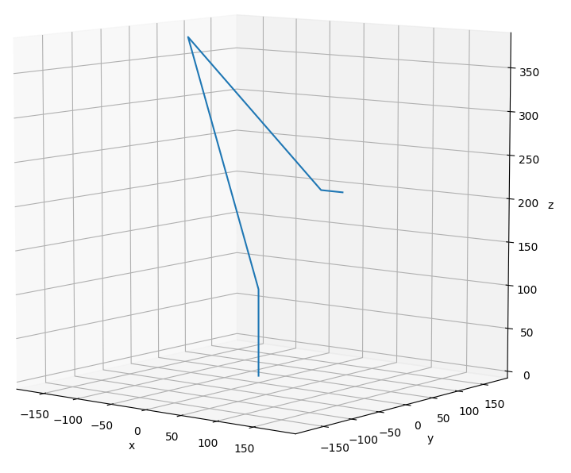

# Forward Kinematics

3D plotting coordinate frames
connected by Denavit-Hartenberg parameters.

Dependencies: 
  - python3
  - numpy
  - matplotlib

Usage:
```
git clone https://github.com/kubakos/forward-kinematics.git
cd forward-kinematics
python3 plotter.py
```

Joint angles of the wireframe robot can be changed
in plotter.py > 'Joint Angle variables'.


